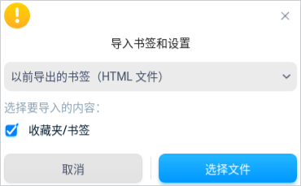
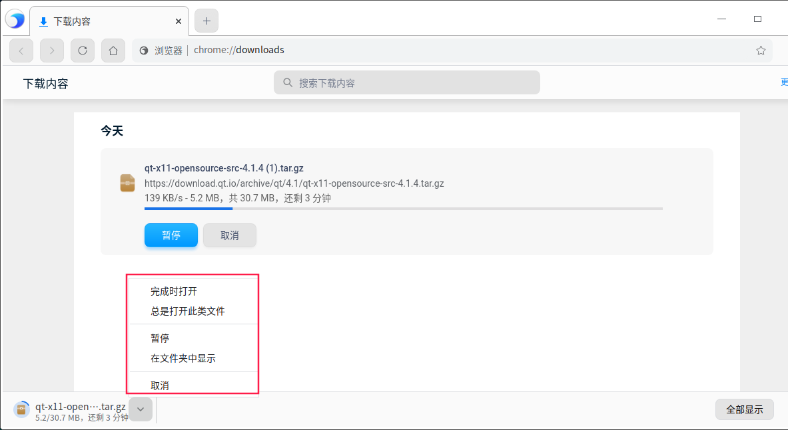
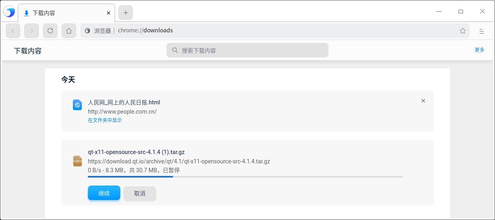
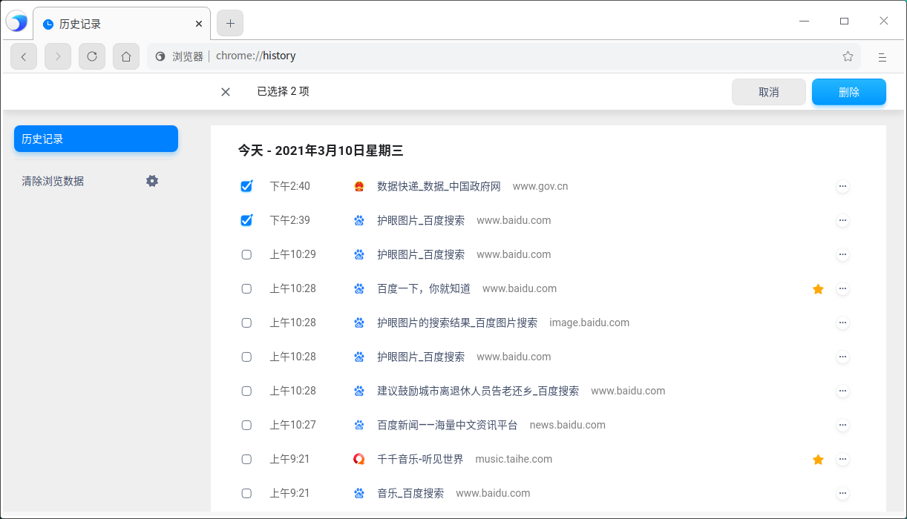
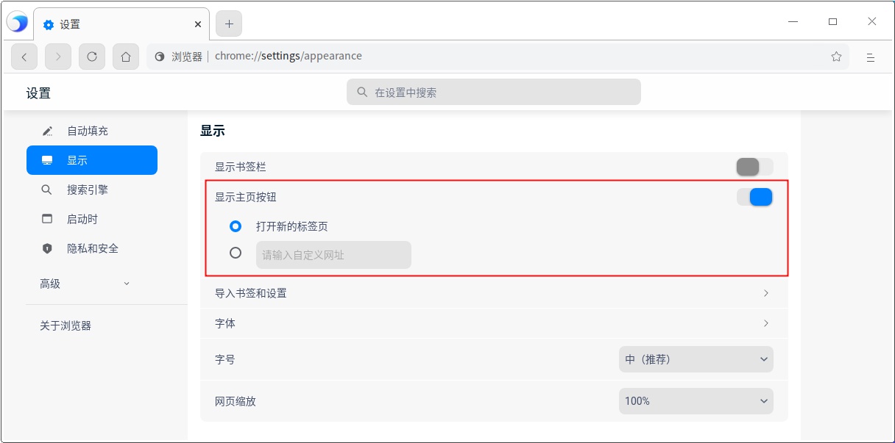
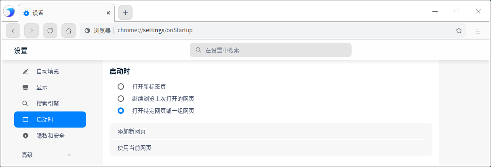
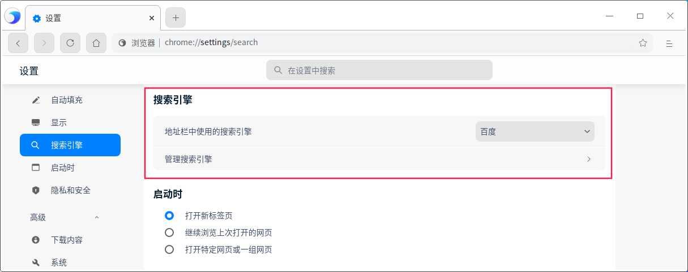
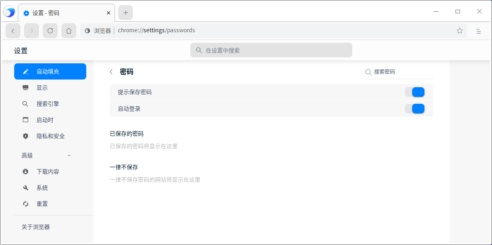
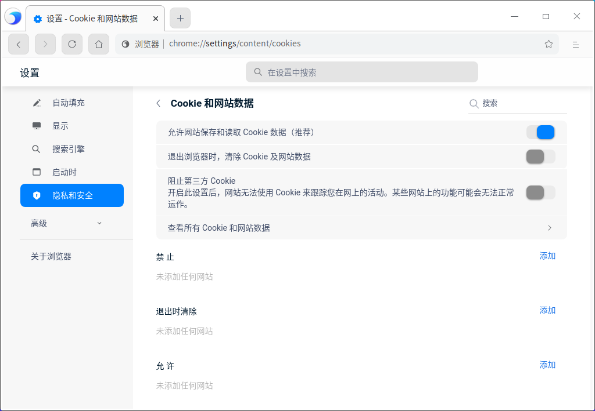
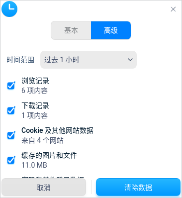

# 浏览器|org.deepin.browser|

## 概述

浏览器是一种检索并展示万维网信息资源的应用程序，可以用来显示万维网或局域网等的文字、图像及其他信息，方便用户快速地查找各种资源。

## 使用入门

通过以下方式运行或关闭浏览器，或者创建浏览器的快捷方式。

### 运行浏览器

1. 单击任务栏上的启动器图标 ，进入启动器页面。
2. 上下滚动鼠标滚轮浏览或通过搜索，找到浏览器图标 ，单击运行。
3. 右键单击  ，您可以：
 - 单击 **发送到桌面**，在桌面创建快捷方式。
 - 单击 **发送到任务栏**，将应用程序固定到任务栏。
 - 单击 **开机自动启动**，将应用程序添加到开机启动项，在电脑开机时自动运行该应用。

> 说明 ：浏览器默认固定在任务栏上。您也可以单击任务栏上的  打开浏览器。

### 关闭浏览器

   - 在浏览器中单击 ，退出浏览器。
   - 在任务栏右键单击  ，选择 **关闭所有** 来退出浏览器。

## 使用浏览器

### 标签页管理

在浏览器中，不仅可以打开、查看多个标签页，还可以在它们之间进行切换。

#### 添加新标签页

通过下列方法之一添加新标签页：

- 在浏览器顶部，单击右侧最后一个标签页旁边的添加按钮  。
- 在浏览器顶部空白处，单击右键并选择 **打开新的标签页**。
- 将鼠标悬停在标签页上，单击右键并选择 **打开新的标签页**。
- 在浏览器中，选择  > **打开新的标签页**。
- 按下快捷键 **Ctrl** + **T**。

#### 打开新窗口

在浏览器中，打开新的窗口，会同时打开新标签页。通过下列方法之一可以打开新窗口：

- 单击标签页并将其拖拽出当前页面，创建一个新的窗口。

- 在浏览器窗口，选择  > **打开新的窗口**。

- 按下快捷键 **Ctrl** + **N**，打开新的窗口。

> 说明：还可以选择打开隐私窗口，进行私密浏览，选择  > **打开新的隐私窗口**。

#### 在标签页中打开本地文件

通过下列方法之一在标签页中打开本地文件。

- 从计算机桌面上或文件夹中，将相应文件拖拽到浏览器标签页中。
- 按下快捷键 **Ctrl** + **O**，弹出文件管理器窗口，并选择想要打开的文件。

#### 在标签页中打开链接

选择需要打开的链接，按住 **Ctrl** 键的同时单击链接，可以打开链接内容。

#### 排列标签页

左右拖拽浏览器顶部的标签页可以改变标签页的排列顺序。

- 要将标签页固定在左侧，请右键单击相应标签页，然后选择 **固定标签页**。已固定标签页的尺寸较小，并且只显示网站的图标。

- 要取消固定标签页，请右键单击相应标签页，然后选择 **取消固定标签页**。

#### 关闭标签页

选中对应的标签页，通过下列方法之一关闭标签页。

- 单击右上角关闭标签页；
- 右键单击相应的标签页，然后选择 **关闭标签页**、**关闭其他标签页** 或 **关闭右侧标签页** 。

#### 恢复标签页或窗口

如果您无意中关闭了某个标签页或窗口，右键单击标签栏空白处，选择 **重新打开关闭的标签页** 。

#### 强行关闭页面或应用

如果标签页、窗口或扩展程序无法正常运行，在任务栏中右键单击  ，选择 **强制退出** 将其强行关闭。

### 书签管理

#### 添加书签

在浏览器中可以将常用的网页添加到书签，便于快速打开浏览。

1. 打开需要收藏的网页，通过下列方法之一添加书签。

   - 单击地址栏右侧的添加书签图标；
   - 选择    > **书签**  > **将此页添加为书签**；
   - 选择    > **书签**  > **将所有页面添加为书签**；

2. 弹出添加书签窗口，设置书签名称或新建文件夹并将书签放入文件夹，单击 **保存**。

#### 查找书签

1. 在浏览器中，选择    > **书签**  > **书签管理器**。
2. 单击书签管理器顶部的搜索按钮，输入关键字查找书签。

#### 修改书签

1. 在浏览器中，选择    > **书签**  > **书签管理器**。
2. 在书签管理器页面，选择一个书签，单击书签旁边的操作按钮或右键选择 **修改**，可以修改书签。

#### 删除书签

1. 在浏览器中，选择    > **书签**  > **书签管理器**。

2. 在书签管理器页面，选择一个书签，通过下列方法之一删除书签。

   - 单击书签旁边的操作按钮，并选择 **删除** 按钮。
   - 单击右键并选择 **删除 **按钮。

>  说明：还可以单击地址栏右侧的星形图标，并在弹出的窗口中单击 **删除** 按钮。

#### 排列书签

1. 在浏览器中，选择    > **书签**  > **书签管理器**。
2. 在书签管理器页面，可以向上或向下拖动书签改变书签排列顺序，也可以使用快捷键复制并粘贴书签，使其按照您预期的顺序排列。

#### 导入书签

1. 在浏览器中，选择    > **书签**  > **导入书签和设置** 。

2. 在书签导入页面，在下拉框中选择“以前导出的书签（HTML文件）”，单击 **选择文件**。

   

3. 弹出文件管理器窗口，选择书签html文件后，导入的书签会显示在书签栏。

### 下载管理

将浏览器中的网页、图片等文件下载保存到计算机或存储设备上。

#### 下载文件

1. 在浏览器中，打开下载文件所在的网页。
2. 保存相应文件：

   - 大多数文件：单击下载链接。或者，右键单击相应文件并选择 **另存为**。
   - 图片：右键单击相应图片并选择 **图片另存为**。
3. 根据页面提示，选择下载文件的存放路径，然后单击 **保存**。

4. 下载完毕后，该文件会显示在浏览器底部，单击文件名即可打开这个文件。
   如果想查看该文件所在的路径，请单击文件名旁边的向上箭头，并选择 **在文件夹中显示**，也可以在“下载内容”页面中查看下载文件。

您还可以设置自动下载项：

1. 在浏览器中，选择   > **设置**，进入设置页面。
2. 在左侧导航栏单击  **隐私和安全**，单击网站设置旁边的更多图标 >，进入网站设置页面。
3. 在“权限”区域，单击自动下载项旁边的更多图标 >，可以开启自动下载询问功能。

#### 暂停或取消下载

- 在浏览器底部，找到要暂停或取消下载的文件，单击文件名旁单击向上箭头，选择 **暂停**/**继续** 或 **取消** 按钮。

  

- 在浏览器中选择    > **下载内容**，选择 **暂停**/**继续** 或 **取消** 按钮。

#### 查看下载记录

在浏览器中选择    > **下载内容**，可以查看过往的下载记录、查询下载文件。

- 要打开文件，请单击相应的文件名。系统会根据文件类型使用默认的应用打开该文件。
- 要从历史记录中移除某项下载内容，请单击文件右侧的移除图标 。系统会将该下载记录从下载页面中移除，但不会删除下载的文件。

#### 设置默认存放路径

指定下载内容的默认保存位置，也可以在每次下载时选择特定的目标位置。

1. 在浏览器中，选择    > **设置**，进入设置页面。

2. 单击高级下拉框，继续单击 **下载内容**，设置下载文件的默认存放路径。

   

> 窍门：如果您要在每次下载时选择具体的位置，请开启询问保存位置功能。

### 历史记录管理

#### 查看历史记录

历史记录包含了浏览器使用期间内所访问的网站地址与具体时间。

在浏览器中选择    > **历史记录**，进入历史记录页面。

#### 删除历史记录

在历史记录页面，通过下列方法之一删除历史记录。

- 勾选需要删除的历史记录，单击页面右上角的 **删除** 按钮。
- 单击某条历史记录旁边的操作按钮，并选择 **从历史记录中移除**。

还可以清除浏览数据，具体操作请参阅 [清除浏览数据](#清除浏览数据)。

### 搜索网络信息

使用浏览器在互联网上、书签列表和浏览记录中快速找到所需信息。

1. 在浏览器顶部地址栏中，输入需要搜索的信息，并在键盘上按下 **Enter** 键。
2. 选择 **网页**、**图片**、**新闻**、**视频** 或 **地图** 进行查找。

#### 查找内容

在网页中查找特定字词或短语。

1. 在浏览器中打开一个网页，在键盘上按下 **Ctrl** +**F**，或单击    > **查找**。
2. 在窗口的右上角出现的搜索框中输入关键字，按 **Enter** 键进行搜索。
3. 系统会以蓝色突出显示匹配内容，可以根据滚动条上的蓝色标记查看所有匹配内容在网页中的位置。

#### 搜索内容

1. 在浏览器中打开一个网页，使用鼠标左键选中某个字词、短语。
3. 单击右键并选择搜索选项，则可以使用您的默认搜索引擎开始搜索相关网页。

### 打印

1. 在浏览器中，选择需要打印的内容（网页、图片等文件）。
2. 单击右键选择 **打印**，或选择    > **打印**。
3. 弹出打印预览页面，选择目标打印机、设置打印参数等。
4. 准备就绪后，单击 **打印**。

### 查看源代码

在页面空白处，单击右键并选择 **查看网页源代码**。

### 开发者工具

当需要设计UI或调试网站时，可以打开开发者工具。

- 选择    > **更多** > **开发者工具**。
- 在页面空白处，单击右键并选择 **检查**。
- 按下键盘上的F12。

> 注意：请勿用于非法途径。

## 设置

### 设置默认浏览器

当打开浏览器时，如果弹出“浏览器不是您的默认浏览器”提示框，单击 **设为默认浏览器**。

> 窍门：在控制中心中将浏览器设置为默认的网页程序，具体操作请参阅 [默认程序设置](dman:///dde#默认程序设置)。

### 设置主页和启动页

对浏览器进行自定义，使其在打开主页或启动页时显示任意网页。这两个网页并不相同，除非您将二者设置为相同的网页。 

- 启动页是启动浏览器后显示的第一个网页。
- 主页是单击主页图标  后进入的网页。

#### 设置主页

1. 在浏览器中，选择    > **设置** ，进入设置页面。
2. 在左侧导航栏单击  **显示**，开启显示主页按钮，主页按钮 便会显示在地址栏的左侧。还可以设置打开主页时显示的网页：
   - **打开的新标签页**：每次单击主页按钮，会跳转到新的标签页。
   - **输入自定义的网址**：每次单击主页按钮，会跳转到指定的网页。

#### 设置启动页

1. 在浏览器中，选择    > **设置** ，进入设置页面。 
2. 在左侧导航栏单击 **启动时**，可以设置启动浏览器时显示的网页。
   - **打开新标签页**：启动浏览器后，会打开一个新的标签页。
   - **继续浏览上次打开的网页**：启动浏览器后，重新打开退出浏览器时正在浏览的网页。
     系统会保存Cookie 和网站数据，因此您当时登录的任何网站（例如 baidu）都会再次打开。如果不想自动登录到这些网页，请执行以下操作：
      1. 打开浏览器，选择    > **设置** ，进入设置页面。
      2. 在左侧导航栏单击 **隐私和安全**，继续单击网站设置旁边的更多图标 >，进入内容网站设置页面。
      3. 单击Cookie 和网站数据旁边的更多图标 >，开启“退出浏览器时清除Cookie 和网站数据”功能。

   - **打开特定网页或一组网页**：启动浏览器后，打开任意指定的网页。您可以在下方文本框中添加新网页，后续也可以进行修改或删除。

>  说明：

- 如果您发现主页或启动页并不是您自己设置的网页，则表明您的系统上可能存在恶意软件。

- 如果您使用的是单位或学校的浏览器，网络管理员可能会为您选择启动页，那么您无法进行更改。如需获取更多帮助，请咨询您的管理员。

### 搜索引擎管理

1. 在浏览器中，通过下列方法之一进入管理搜索引擎页面。

   - 将光标置于地址栏，单击右键，选择 **修改搜索引擎**。

   - 选择    > **设置**，在左侧导航栏单击 **搜索引擎**。
   
2. 进入搜索引擎管理页面后，可以添加新的搜索引擎，或修改当前的搜索引擎。

   

> 说明：如果您的默认搜索引擎突然发生变化，则表明您的系统可能已遭到恶意软件的攻击。

### 密码管理

如果您在某个网站上输入新密码，浏览器会询问您是否要保存此密码。如需保存，请单击 **保存**。

####  使用已保存的密码登录

如果您在之前访问某个网站时保存了该网站的密码，再次登录时就不需要输入用户名和密码。

- 如果您为该网站保存了一组用户名和密码：浏览器会自动填写登录表单。
- 如果您保存了多组用户名和密码：请选择用户名字段，然后选择您要使用的登录信息。

#### 删除已保存的密码

1. 在浏览器中，选择    > **设置**，进入设置页面。

2. 在左侧导航栏单击 **自动填充**，继续单击密码旁边的更多图标 >，进入密码详情页面。

   

3. 可查看已保存密码的网站或删除密码。

要清除所有已保存的密码，具体操作请参阅 [清除浏览数据](#清除浏览数据)，然后勾选“密码和其他登录数据”。

#### 启用或停用保存密码的功能

默认情况下，浏览器会询问您是否要保存密码。您可以随时启用或停用此功能。

1. 在浏览器中，选择    > **设置**，进入设置页面。
2. 在左侧导航栏单击 **自动填充**，继续单击密码旁边的更多图标 >，进入密码详情页面。
3. 开启或关闭提示保存密码功能。

### 隐私和安全

#### 网站设置

在网站设置页面，可以查看各网站的权限及存储的数据。

1. 在浏览器中，选择    > **设置**，进入设置页面。
2. 在左侧导航栏单击 **隐私和安全**，继续单击网站设置旁边的更多图标  >，进入网站设置页面。
3. 可以查看各网站的权限及存储的数据，在“权限”区域，您还可以设置以下内容。

**Cookie和网站数据**

Cookie 通过保存浏览信息来让您获得更轻松的在线体验，您可以进行以下设置：

- **允许网站保存和读取Cookie数据（推荐）**：默认设置。
- **退出浏览器时清除Cookie 和网站数据**：在退出浏览器后自动删除相应 Cookie。
- **阻止第三方Cookie**：网站无法使用Cookie来跟踪您在网上的活动，某些网站上的功能可能无法正常运作。
- 单击 **查看所有Cookie和网站数据**。
  - 删除特定Cookie和网站数据：搜索Cookie和网站数据的名称，在该网站的网址右侧单击删除按钮。
  - 删除所有的Cookie和网站数据·：单击 **全部删除**。

还可以在 **禁止**、**退出时清除**、**允许 **选项下输入对应网站地址。

**位置信息**

默认情况下，浏览器会询问您是否允许某个网站查看您的确切位置信息。

- **允许的网站**：允许网站访问位置信息。如果您允许浏览器将您的位置信息分享给某个网站，浏览器会向搜索引擎的位置信息服务发送信息，以便了解您的大致位置。随后，浏览器会将您的位置信息分享给该网站。
- **禁止的网站**：禁止网站访问位置信息。

**摄像头和麦克风**

某些网站可能会请求使用您的摄像头和麦克风，默认情况下，浏览器会询问您是否允许某个网站开启摄像头和麦克风。

- **允许的网站**：允许网站开启摄像头和麦克风。
- **禁止的网站**：禁止网站开启摄像头和麦克风。

**JavaScript**

JavaScript 有助于提高网站的交互性，您可以添加允许和禁止的网站。

**自动下载项**

如果要从某个网站下载多个文件，请选择是否要自动下载这些文件，您可以添加允许和禁止的网站。

以上简单的介绍几种网站权限，还有图片、Flash、声音、USB设备、文件修改等网站权限可以设置。

#### 清除浏览数据

1. 通过下列方法之一进入清除浏览数据页面。

   - 选择    > **设置** > **隐私和安全** > **清除浏览数据**
   - 选择    > **历史记录** > **清除浏览数据**

   - 选择    > **更多** > **清除浏览数据**

2. 在基本和高级操作页面勾选需要清除的数据：

     - 清除某段时间的数据，如：
       - 过去1小时
       - 过去24小时
       - 过去7天
       - 近4周
       - 时间不限
     - 清除浏览记录
     - 删除Cookie和其他网站数据
     - 清除缓存的图片和文件
     - 清除下载记录
     - 清除密码和其他登录数据
     - 清除已保存的自动填充表单数据
     - 清除网站设置数据等

     

3. 勾选需要删除的数据后，单击 **清除数据**。

#### 证书管理

在浏览器中可以导入证书，并管理证书。

1. 在浏览器中，选择    > **设置**，进入设置页面。
2. 在左侧导航栏单击 **隐私和安全**，继续单击管理证书旁边的更多图标 >，进入管理证书页面。
3. 单击 **导入**，跳转到文件管理器，选择证书文件进行导入。

#### 随浏览流量一起发送“不跟踪”请求

此功能默认关闭，开启后代表您不想被第三方网站追踪。

### 系统

硬件解码加速：把计算量非常大的工作分配给专门的硬件来处理以减轻CPU的工作量，此功能默认开启。比如播放视频，就可以利用显卡来解码，这样CPU就可以处理其他的任务，不会造成操作系统卡顿。

### 重置

单击后 ，可以重置部分设置项，例如重置搜索引擎；但是系统不会清除您的书签、历史记录和保存的密码。

## 主题

窗口主题包含浅色主题、深色主题和系统主题。

1. 在浏览器中，选择> **主题** 。
2. 选择一个主题颜色。

## 帮助

1. 在浏览器中，选择   > **帮助**。
2. 查看帮助手册，进一步了解和使用浏览器。

## 关于浏览器

1. 在浏览器中，选择   > **关于浏览器**。
2. 查看浏览器的版本和介绍。

## 退出

在浏览器中，选择   > **退出**，可以退出浏览器。 