# 瀏覽器|org.deepin.browser|

## 概述

瀏覽器是一種檢索並展示萬維網訊息資源的應用程序，可以用來顯示萬維網或局域網等的文字、圖像及其他訊息，方便用戶快速地查找各種資源。

## 使用入門

通過以下方式運行或關閉瀏覽器，或者創建瀏覽器的快捷方式。

### 運行瀏覽器

1. 單擊任務欄上的啟動器圖標 ，進入啟動器界面。
2. 上下滾動鼠標滾輪瀏覽或通過搜索，找到瀏覽器圖標 ，單擊運行。
3. 右鍵單擊  ，您可以：

 - 單擊 **發送到桌面**，在桌面創建快捷方式。
 - 單擊 **發送到任務欄**，將應用程序固定到任務欄。
 - 單擊 **開機自動啟動**，將應用程序添加到開機啟動項，在電腦開機時自動運行該應用。

> 說明 ：瀏覽器默認固定在任務欄上。您也可以單擊任務欄上的  打開瀏覽器。

### 關閉瀏覽器

   - 在瀏覽器窗口單擊 ，退出瀏覽器。
   - 在任務欄右鍵單擊  ，選擇 **關閉所有** 來退出瀏覽器。

## 使用瀏覽器

### 分頁管理

在瀏覽器中，不僅可以打開、查看多個分頁，還可以在它們之間進行切換。

#### 添加新分頁

通過下列方法之一添加新分頁：

- 在瀏覽器頂部，單擊右側最後一個分頁旁邊的 。
- 在瀏覽器頂部空白處，單擊右鍵並選擇 **新增分頁**。
- 將鼠標懸停在分頁上，單擊右鍵並選擇 **打開新分頁**。
- 在瀏覽器中，選擇  > **新增分頁**。
- 按下快捷鍵 **Ctrl** + **T**。

#### 打開新視窗

在瀏覽器中，打開新的視窗，會同時打開新分頁。通過下列方法之一打開新視窗：

- 單擊分頁並將其拖拽出當前頁面，創建一個新的視窗。

- 在瀏覽器中，選擇  > **新增視窗**。

- 按下快捷鍵 **Ctrl** + **N**，打開新的視窗。

> 說明：可以選擇打開無痕式視窗，進行私密瀏覽，選擇  > **新增無痕式視窗**。

#### 在分頁中打開本地文件

通過下列方法之一在分頁中打開本地文件。

- 從計算機桌面上或文件夾中，將相應文件拖拽到瀏覽器分頁中。
- 按下快捷鍵 **Ctrl** + **O**，彈出文件管理器窗口，並選擇想要打開的文件。

#### 在分頁中打開鏈接

選擇需要打開的鏈接，按住 **Ctrl** 鍵的同時單擊鏈接，可以打開鏈接內容。

#### 排列分頁

左右拖拽瀏覽器頂部的標籤頁可以改變標籤頁的排列順序。

- 要將分頁固定在左側，請右鍵單擊相應分頁，然後選擇 **固定分頁**。已固定分頁的尺寸較小，並且只顯示網站的圖標。

- 要取消固定分頁，請右鍵單擊相應分頁，然後選擇 **取消固定分頁**。

#### 關閉分頁

選中對應的分頁，通過下列方法之一關閉分頁。

- 單擊右上角關閉分頁；
- 右鍵單擊相應的分頁，然後選擇 **關閉分頁**；

#### 恢復分頁或視窗

如果您無意中關閉了某個分頁或窗口，右鍵單擊標籤欄空白處，選擇 **重新開啟已關閉分頁**。

#### 強行關閉頁面或應用

如果分頁、窗口或擴展程序無法正常運行，在任務欄中右鍵單擊  ，選擇 **強制退出** 將其強行關閉。

### 書籤管理

#### 添加書籤

在瀏覽器中可以將常用的網頁添加到書籤，便於快速打開瀏覽。

1. 打開需要收藏的網頁，通過下列方法之一添加書籤。
   - 單擊地址欄右側的添加書籤圖標 ；
   - 選擇    > **書籤**  > **將此分頁加入書籤**；
   - 選擇    > **書籤**  > **將所有分頁加入書籤**；
2. 彈出添加書籤窗口，設置書簽名稱或新增資料夾並將書籤放入文件夾，單擊 **儲存**。

#### 查找書籤

1. 在瀏覽器中，選擇    > **書籤**  > **書籤管理員**。
2. 單擊書籤管理器頂部的搜索按鈕，輸入關鍵字查找書籤。

#### 修改書籤

1. 在瀏覽器中，選擇    > **書籤**  > **書籤管理員**。

2. 在書籤管理器頁面，選擇一個書籤，單擊書籤旁邊的操作按鈕或右鍵選擇 **編輯**，可以修改書籤。

   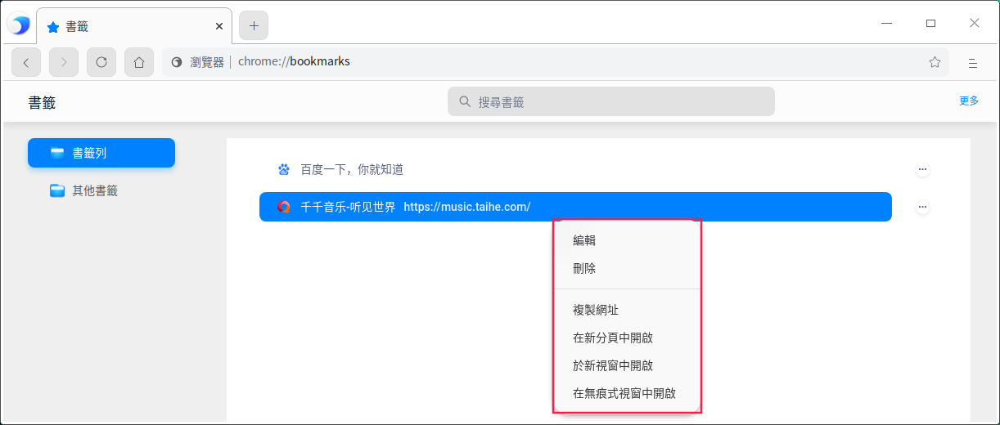

#### 刪除書籤

1. 在瀏覽器中，選擇    > **書籤**  > **書籤管理員**。
2. 在書籤管理器頁面，選擇一個書籤，通過下列方法之一刪除書籤。

   - 單擊書籤旁邊的操作按鈕，並選擇 **刪除** 按鈕。
   - 單擊右鍵並選擇 **刪除** 按鈕。

>  說明：還可以單擊地址欄右側的星形圖標，並在彈出的窗口中單擊 **移除** 按鈕。

#### 排列書籤

1. 在瀏覽器中，選擇    > **書籤**  > **書籤管理員**。
2. 在書籤管理器頁面，可以向上或向下拖動書籤改變書籤排列順序，也可以使用快捷鍵複製並黏貼書籤，使其按照您預期的順序排列。

#### 導入書籤

1. 在瀏覽器中，選擇    > **書籤**  > **導入書籤和設定**。

2. 在書籤導入頁面，在下拉框中選擇 **HTML格式的書籤檔案**，單擊 **選擇檔案**。

   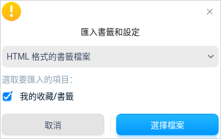

3. 彈出文件管理器窗口，選擇書籤html文件後，導入的書籤會顯示在書籤欄。

### 下載管理

將瀏覽器中的網頁、圖片等文件下載保存到計算機或存儲設備上。

#### 下載文件

1. 在瀏覽器中，打開下載文件所在的網頁。
2. 保存相應文件：

   - 大多數文件：單擊下載鏈接。或者，右鍵單擊相應文件並選擇 **另存連結為**。
   - 圖片：右鍵單擊相應圖片並選擇 **另存圖片**。
3. 根據頁面提示，選擇下載文件的存放路徑，然後單擊 **保存**。

4. 下載完畢後，該文件會顯示在瀏覽器底部，單擊文件名即可打開這個文件。
   如果想查看該文件所在的路徑，請單擊文件名旁邊的向上箭頭，並選擇 **在資料夾中顯示**，也可以在「下載」頁面中查看下載文件。

您還可以設置自動下載項：

1. 在瀏覽器中，選擇    > **設定**，進入設置頁面。
2. 在左側導航欄單擊  **隱私權和安全性**，單擊網站設定旁邊的更多圖標 >，進入網站設定頁面。
3. 在「權限」區域，單擊自動下載項旁邊的更多圖標 >，可以開啟自動下載詢問功能。

#### 暫停或取消下載

- 在瀏覽器底部，找到要暫停或取消下載的文件，單擊文件名旁單擊向上箭頭，選擇 **暫停**/**繼續** 或 **取消** 按鈕。

  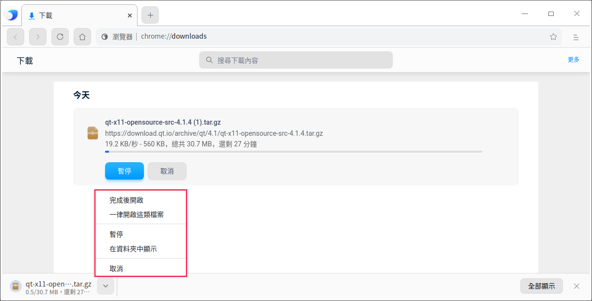

- 在瀏覽器中選擇    > **下載**，選選擇 **暫停**/**繼續** 或 **取消 **按鈕。

#### 查看下載記錄

在瀏覽器中選擇    > **下載**，可以查看過往的下載記錄、查詢下載文件。

- 要打開文件，請單擊相應的文件名。系統會根據文件類型使用默認的應用打開該文件。
- 要從歷史記錄中移除某項下載內容，請單擊文件右側的移除圖標 。系統會將該下載記錄從下載頁面中移除，但不會刪除下載的文件。

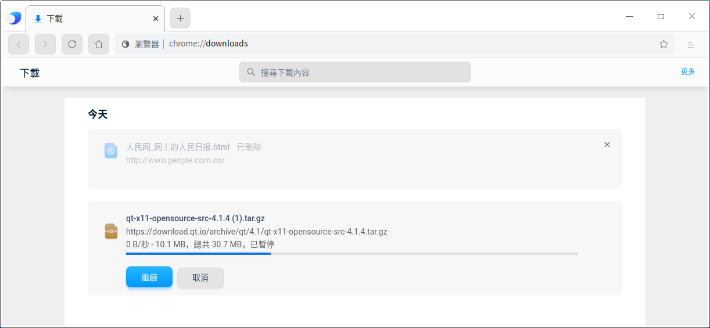

#### 設置默認存放路徑

指定下載內容的默認保存位置，也可以在每次下載時選擇特定的目標位置。
1. 在瀏覽器中選擇     > **設定**，進入設定頁面。

2. 單擊進階下拉框，繼續單擊 **下載**，設置下載文件的默認存放路徑。

   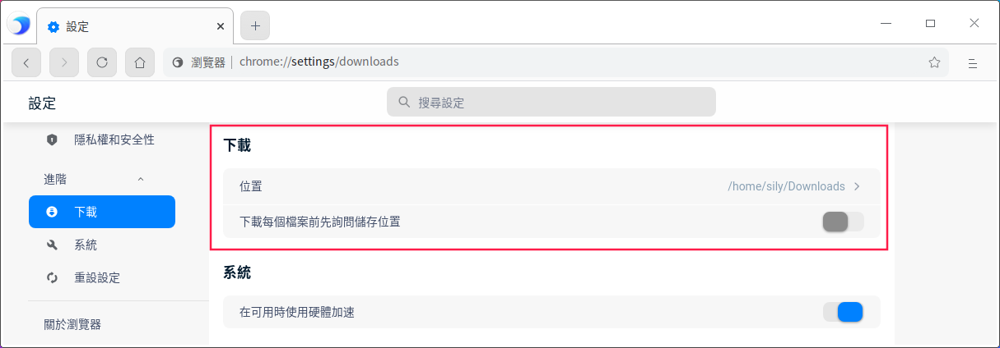

> 竅門：如果您要在每次下載時選擇具體的位置，請開啟詢問保存位置功能。

### 歷史記錄管理

#### 查看歷史記錄

歷史記錄包含了瀏覽器使用期間內所訪問的網站地址與具體時間。

在瀏覽器中選擇    > **記錄**，進入歷史記錄頁面。

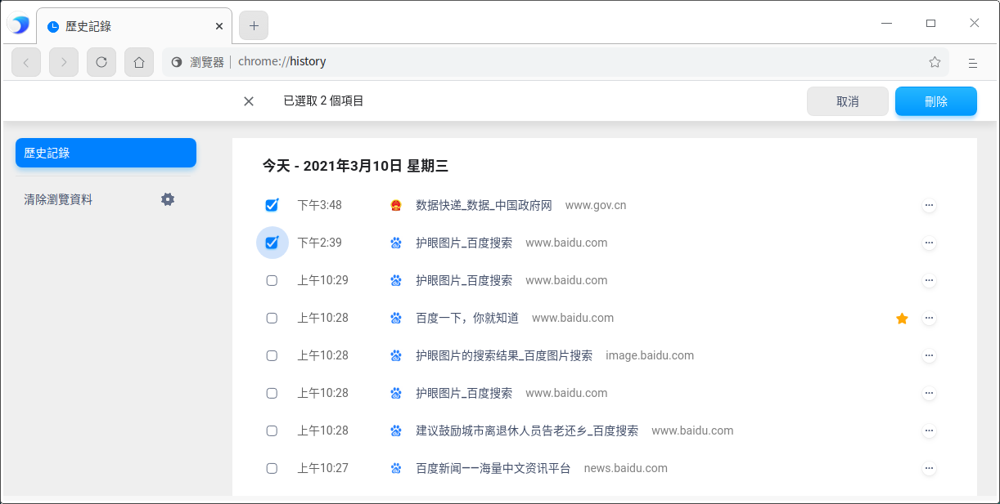

#### 刪除歷史記錄

在歷史記錄頁面，通過下列方法之一刪除歷史記錄。

- 勾選需要刪除的歷史記錄，單擊頁面右上角的 **刪除** 按鈕。
- 單擊某條歷史記錄旁邊的操作按鈕，並選擇 **從記錄中移除**。

還可以清除瀏覽數據，具體操作請參閱 [清除瀏覽資料](#清除瀏覽資料)。

### 搜索網絡訊息

使用瀏覽器在互聯網上、書籤列表和瀏覽記錄中快速找到所需訊息。

1. 在瀏覽器頂部地址欄中，輸入需要搜索的訊息，並在鍵盤上按下 **Enter** 鍵。
2. 選擇 **網頁**、**圖片**、**新聞內容**、**影片** 或 **地圖** 進行查找。

#### 查找內容

在網頁中查找特定字詞或短語。

1. 在瀏覽器中打開一個網頁，在鍵盤上按下 **Ctrl** +**F**，或選擇    > **尋找**。
2. 在窗口的右上角出現的搜索框中輸入關鍵字，按 **Enter** 鍵進行搜索。
3. 系統會以藍色突出顯示匹配內容，可以根據滾動條上的藍色標記查看所有匹配內容在網頁中的位置。

#### 搜索內容

1. 在瀏覽器中打開一個網頁，鼠標左鍵選中某個字詞、短語。
2. 單擊右鍵並選擇搜索選項，則可以使用您的默認搜尋引擎開始搜索相關網頁。

### 列印

1. 在瀏覽器中，選擇需要打印的內容（網頁、圖片或文件）。
2. 單擊右鍵選擇 **列印**，或選擇    > **列印**。
3. 彈出打印預覽頁面，選擇目標打印機、設置打印參數等。
4. 準備就緒後，單擊 **列印**。

### 檢視網頁原始碼

在頁面空白處，單擊鼠標右鍵並選擇 **檢視網頁原始碼**。

### 開發人員工具

當需要設計UI或調試網站時，可以打開開發者工具。

- 選擇    > **更多工具** > **開發人員工具**。
- 在頁面空白處，單擊右鍵並選擇 **檢查**。
- 按下鍵盤上的F12。

> 注意：請勿用於非法途徑。

## 設定

### 設定預設瀏覽器

當打開瀏覽器時，如果彈出「這不是您的預設瀏覽器」提示框，單擊 **設定為預設瀏覽器**。

> 竅門：在控制中心中將瀏覽器設置為默認的網頁程序，具體操作請參閱 [默認程序設定](dman:///dde#默認程序設置)。

### 設定首頁和起始畫面

對瀏覽器進行自定義，使其在打開首頁或起始畫面時顯示任意網頁。這兩個網頁並不相同，除非您將二者設置為相同的網頁。 

- 起始畫面是啟動瀏覽器後顯示的第一個網頁。
- 首頁是單擊首頁圖標  後進入的網頁。

#### 設定首頁

1. 在瀏覽器中，單擊    > **設定**，進入設定頁面。
2. 在左側導航欄單擊  **外觀**，開啟顯示首頁按鈕，首頁按鈕 便會顯示在地址欄的左側。還可以設置打開首頁時顯示的網頁：
   - **新分頁**：每次單擊首頁按鈕，會跳轉到新的分頁。
   - **輸入自訂網址**：每次單擊首頁按鈕，會跳轉到指定的網頁。

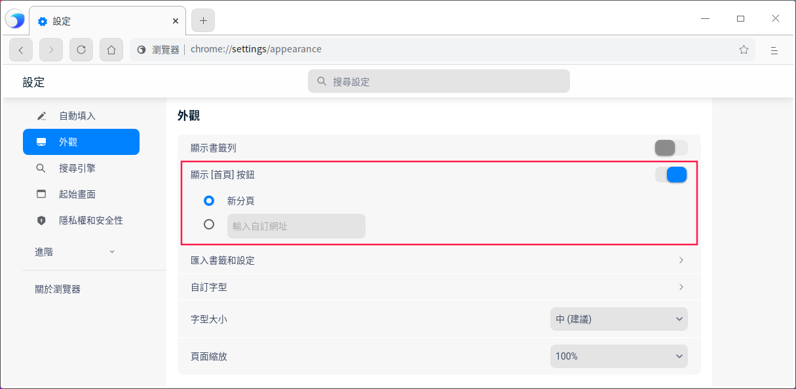

#### 設置起始畫面

1. 在瀏覽器窗口，單擊    > **設定**，進入設定頁面。
2. 在左側導航欄單擊 **起始畫面**，可以設置啟動瀏覽器時顯示的網頁。
   - **開啟新分頁**：啟動瀏覽器後，會打開一個新的分頁。
   - **繼續瀏覽上次開啟的網頁**：啟動瀏覽器後，重新打開退出瀏覽器時正在瀏覽的網頁。
     系統會保存Cookie 和網站數據，因此您當時登錄的任何網站（例如 baidu）都會再次打開。如果不想自動登錄到這些網頁，請執行以下操作：
      1. 打開瀏覽器，選擇    > **設定**，進入設定頁面。
      2. 在左側導航欄單擊 **私隱權和安全性**，繼續單擊網站設置旁邊的更多圖標 >，進入內容網站設置頁面。
      3. 單擊Cookie 和網站數據旁邊的更多圖標 >，開啟「退出瀏覽器時清除Cookie 和網站數據」功能。

   - **開啟某個特定網頁或一組網頁**：啟動瀏覽器後，打開任意指定的網頁。您可以在下方文本框中添加新網頁，後續也可以進行修改或刪除。

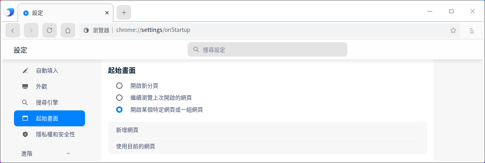

>  說明：

- 如果您發現首頁或起始畫面並不是您自己設置的網頁，則表明您的系統上可能存在惡意軟件。

- 如果您使用的是單位或學校的瀏覽器，網絡管理員可能會為您選擇起始畫面，那麼您無法進行更改。如需獲取更多幫助，請諮詢您的管理員。

### 搜尋引擎管理

1. 在瀏覽器中，通過下列方法之一進入管理搜尋引擎頁面。

   - 將光標置於地址欄，單擊右鍵，選擇 **編輯搜尋引擎**。

   - 選擇    > **設定**，在左側導航欄選擇 **搜尋引擎**，並單擊 **管理搜尋引擎**。
   
2. 進入搜尋引擎管理頁面後，可以添加新的搜尋引擎，或修改當前的搜尋引擎。

   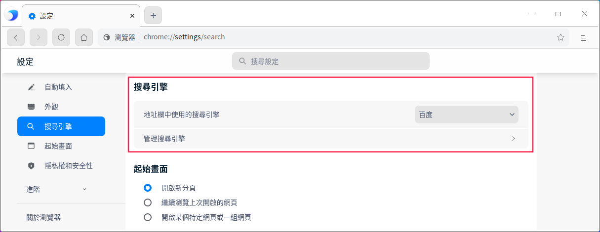

> 说明：如果默认搜索引擎突然发生变化，则表明您的系统可能已遭到恶意软件的攻击。

### 密碼管理

如果您在某個網站上輸入新密碼，瀏覽器會詢問您是否要保存此密碼。如需保存，請單擊 **保存**。

####  使用已保存的密碼登錄

如果您在之前訪問某個網站時保存了該網站的密碼，再次登錄時就不需要輸入用戶名和密碼。

- 如果您為該網站保存了一組用戶名和密碼：瀏覽器會自動填寫登錄表單。
- 如果您保存了多組用戶名和密碼：請選擇用戶名字段，然後選擇您要使用的登錄訊息。

#### 刪除已保存的密碼

1. 在瀏覽器中，選擇    > **設定**，進入設定頁面。

2. 在左側導航欄單擊 **自動填入**，繼續單擊密碼旁邊的更多圖標 >，進入密碼詳情頁面。

   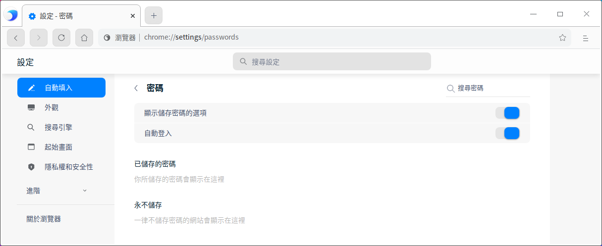

3. 可查看已保存密碼的網站或刪除密碼。

要清除所有已保存的密碼，具體操作請參閱 [清除瀏覽資料](#清除瀏覽資料)，然後勾選「密碼和其他登入資料」。

#### 啟用或停用保存密碼的功能

默認情況下，瀏覽器會詢問您是否要保存密碼。您可以隨時啟用或停用此功能。

1. 在瀏覽器中，選擇    > **設定**，進入設定頁面。
2. 在左側導航欄單擊 **自動填入**，繼續單擊密碼旁邊的更多圖標 >，進入密碼詳情頁面。
3. 開啟或關閉提示保存密碼功能。

### 隱私權和安全性

#### 網站設定

在網站設定頁面，可以查看各網站的權限及存儲的數據。

1. 在瀏覽器中，選擇    > **設定**，進入設定頁面。
2. 在左側導航欄單擊 **隱私權和安全性**，繼續單擊「網站設定」旁邊的更多圖標  >，進入網站設定頁面。
3. 可以查看各網站的權限及存儲的數據，在“權限”區域，您還可以設置以下內容。

**Cookie和網站資料**

Cookie 通過保存瀏覽訊息來讓您獲得更輕鬆的在線體驗，您可以進行以下設置：

- **允許網站儲存和讀取Cookie資料（建議）**：默認設置。
- **退出瀏覽器時，清除Cookie 和網站資料**：在退出瀏覽器後自動刪除相應 Cookie。
- **封鎖第三方Cookie**：網站無法使用Cookie來跟蹤您在網上的活動，某些網站上的功能可能無法正常運作。
- 單擊 **展示所有Cookie和網站資料**。
  - 刪除特定Cookie和網站數據：搜索Cookie和網站數據的名稱，在該網站的網址右側單擊刪除按鈕。
  - 刪除所有的Cookie和網站數據·：單擊 **全部移除**。

還可以在 **封鎖**、**退出時清除**、**允許** 選項下輸入對應網站地址。

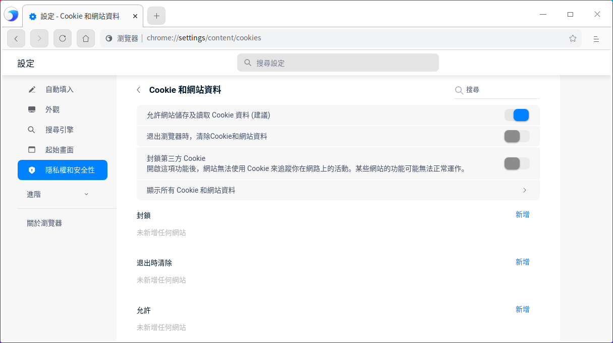

**位置**

默認情況下，瀏覽器會詢問您是否允許某個網站查看您的確切位置訊息。

- **允許的網站**：允許網站訪問位置訊息。如果您允許瀏覽器將您的位置訊息分享給某個網站，瀏覽器會向搜尋引擎的位置訊息服務發送訊息，以便了解您的大致位置。隨後，瀏覽器會將您的位置訊息分享給該網站。
- **封鎖的網站**：禁止網站訪問位置訊息。

**攝影機和麥克風**

某些網站可能會請求使用您的攝影機和麥克風，默認情況下，瀏覽器會詢問您是否允許某個網站開啟攝影機和麥克風。

- **允許的網站**：允許網站開啟攝影機和麥克風。
- **封鎖的網站**：禁止網站開啟攝影機和麥克風。

**JavaScript**

JavaScript 有助於提高網站的交互性，您可以添加允許和封鎖的網站。

**自動下載**

如果要從某個網站下載多個文件，請選擇是否要自動下載這些文件，您可以添加允許和封鎖的網站。

以上簡單的介紹幾種網站權限，還有圖片、音訊、USB裝置、檔案編輯等網站權限可以設置。

#### 清除瀏覽資料

1. 通過下列方法之一進入清除瀏覽數據頁面。

   - 選擇    > **設置** > **隱私權和安全性** > **清除瀏覽資料**
   - 選擇    > **記錄** > **清除瀏覽資料**

   - 選擇    > **更多工具** > **清除瀏覽資料**

2. 在基本和高級操作頁面勾選需要清除的資料：

   - 清除某段時間的資料，如：
     - 過去1小時
     - 過去24小時
     - 過去7天
     - 近4週
     - 不限時間
   - 清除瀏覽記錄
   - 刪除Cookie和其他網站資料
   - 清除快取圖片和檔案
   - 清除下載記錄
   - 清除密碼和其他登錄資料
   - 清除已保存的自動填充表單資料
   - 清除網站設定資料等

   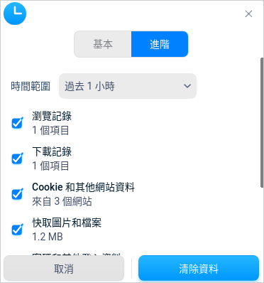

3. 勾選需要刪除的數據後，單擊 **清除資料**。

#### 憑證管理

在瀏覽器中可以導入證書，並管理證書。

1. 在瀏覽器中，選擇    > **設定**，進入設定頁面。
2. 在左側導航欄單擊 **私隱權和安全性**，繼續單擊「 管理憑證 」旁邊的更多圖標 >，進入管理憑證頁面。
3. 單擊 **匯入**，跳轉到文件管理器，選擇證書文件進行匯入。

#### 將「不追蹤」要求與瀏覽流量一併送出

此功能默認關閉，開啟後代表您不想被第三方網站追蹤。

### 系統

在可用時使用硬碟加速：把計算量非常大的工作分配給專門的硬件來處理以減輕CPU的工作量，此功能默認開啟。比如播放影片，就可以利用顯卡來解碼，這樣CPU就可以處理其他的任務，不會造成操作系統卡頓。

### 重設設定

單擊後 ，可以重設部分設定項，例如重設搜尋引擎；系統不會清除您的書籤、歷史記錄和保存的密碼。

## 主題

窗口主題包含淺色主題、深色主題和系統主題。

1. 在瀏覽器中，選擇> **主題**。
2. 選擇一個主題顏色。

## 說明

1. 在瀏覽器中，選擇   > **說明**。
2. 查看說明手冊，進一步了解和使用瀏覽器。

## 關於瀏覽器

1. 在瀏覽器中，選擇   > **關於瀏覽器**。
2. 查看瀏覽器的版本和介紹。

## 結束

在瀏覽器中，選擇   > **結束**，可以结束瀏覽器。