# 瀏覽器|org.deepin.browser|

## 概述

瀏覽器是一種檢索並展示萬維網訊息資源的應用程式，可以用來顯示萬維網或區域網路等的文字、圖像及其他訊息，方便使用者快速地尋找各種資源。

## 使用入門

透過以下方式執行或關閉瀏覽器，或者建立瀏覽器的捷徑。

### 執行瀏覽器

1. 單擊任務欄上的啟動器圖示 ，進入啟動器頁面。
2. 上下滾動滑鼠滾輪瀏覽或透過搜尋，找到瀏覽器圖示 ，單擊執行。
3. 右鍵單擊  ，您可以：
 - 單擊 **建立桌面捷徑**，在桌面建立捷徑。
 - 單擊 **訂選到Dock**，將應用程式固定到任務欄。
 - 單擊 **開機啟動**，將應用程式添加到開機啟動項，在電腦開機時自動執行該應用。

> 說明 ：瀏覽器預設固定在任務欄上。您也可以單擊任務欄上的  開啟瀏覽器。

### 關閉瀏覽器

   - 在瀏覽器中單擊 ，退出瀏覽器。
   - 在任務欄右鍵單擊  ，選擇 **關閉所有** 來退出瀏覽器。

## 使用瀏覽器

### 分頁管理

在瀏覽器中，不僅可以開啟、查看多個分頁，還可以在它們之間進行切換。

#### 添加新分頁

透過下列方法之一添加新分頁：

- 在瀏覽器頂部，單擊右側最後一個分頁旁邊的  
- 在瀏覽器頂部空白處單擊右鍵並選擇 **新增分頁**。
- 將滑鼠放置在分頁標籤上，單擊右鍵，選擇 **打開新分頁**。
- 在瀏覽器中，選擇  > **新增分頁**。
- 按下快捷鍵 **Ctrl** + **T**。

#### 開啟新視窗

在瀏覽器中，開啟新的視窗，會同時開啟新分頁。透過下列方法之一可以開啟新視窗：

- 單擊分頁並將其拖拽出目前頁面，建立一個新的視窗。

- 在瀏覽器視窗，選擇  > **新增視窗**。

- 按下快捷鍵 **Ctrl** + **N**，開啟新的視窗。

> 說明：還可以選擇開啟隱私視窗，進行私密瀏覽，選擇  > **新增無痕式視窗**。

#### 在分頁中開啟本機檔案

透過下列方法之一在分頁中開啟本機檔案。

- 從電腦桌面上或資料夾中，將相應檔案拖拽到瀏覽器分頁中。
- 按下快捷鍵 **Ctrl** + **O**，彈出檔案管理器視窗，並選擇想要開啟的檔案。

#### 在分頁中開啟連結

選擇需要開啟的連結，按住 **Ctrl** 鍵的同時單擊連結，可以開啟連結內容。

#### 排列分頁

左右拖拽瀏覽器視窗頂部的分頁可以改變分頁的排列順序。

- 要將分頁固定在左側，請右鍵單擊相應分頁，然後選擇 **固定分頁**。已固定分頁的尺寸較小，並且只顯示網站的圖示。
- 要取消固定分頁，請右鍵單擊相應分頁，然後選擇 **取消固定分頁**。

#### 關閉分頁

選中對應的分頁，透過下列方法之一關閉分頁。

- 單擊右上角關閉分頁；
- 右鍵單擊相應的分頁，然後選擇 **關閉分頁**，**關閉其他分頁** 或 **關閉右邊的分頁**。

#### 復原分頁或視窗

如果您無意中關閉了某個分頁或視窗，右鍵單擊標籤欄空白處，選擇 **重新開啟已關閉分頁** 。

#### 強行關閉頁面或應用

如果分頁、視窗或擴展程式無法正常執行，在任務欄中右鍵單擊  ，選擇 **強制離開** 將其強行關閉。

### 書籤管理

#### 添加書籤

在瀏覽器中可以將常用的網頁添加到書籤，便於快速開啟瀏覽。

1. 開啟需要收藏的網頁，透過下列方法之一添加書籤。

   - 單擊地址欄右側的添加書籤圖示 ；
   - 選擇    > **書籤**  > **將此分頁加入書籤**。
   - 選擇    > **書籤**  > **將所有分頁加入書籤**。

2. 彈出添加書籤視窗，設定書籤名稱或建立資料夾並將書籤放入資料夾，單擊 **儲存**。

#### 查找書籤

1. 在瀏覽器中，選擇    > **書籤**  > **書籤管理員**。
2. 單擊書籤管理器頂部的搜尋按鈕，輸入關鍵字查找書籤。

#### 修改書籤

1. 在瀏覽器中，選擇    > **書籤**  > **書籤管理員**。
2. 在書籤管理器頁面，選擇一個書籤，單擊書籤旁邊的操作按鈕或右鍵選擇 **編輯**，可以修改書籤。

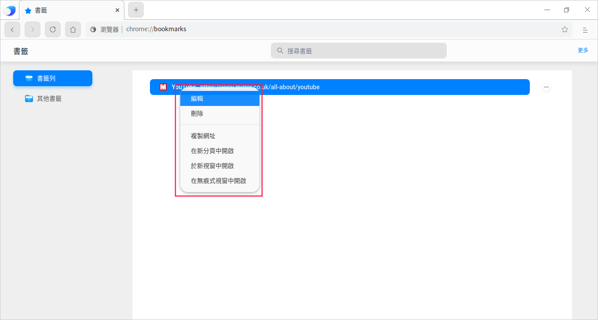

#### 刪除書籤

1. 在瀏覽器中，選擇    > **書籤**  > **書籤管理員**。

2. 在書籤管理器頁面，選擇一個書籤，透過下列方法之一刪除書籤。

   - 單擊書籤旁邊的操作按鈕，並選擇 **刪除** 按鈕。
   - 單擊右鍵並選擇 **刪除**按鈕。

>  說明：還可以單擊地址欄右側的星形圖示，並在彈出的視窗中單擊 **刪除** 按鈕。

#### 排列書籤

1. 在瀏覽器中，選擇    > **書籤**  > **書籤管理員** 。
2. 在書籤管理器頁面，可以向上或向下拖動書籤改變書籤排列順序，也可以複製並貼上書籤，使其按照您預期的順序排列。

#### 匯入書籤

1. 在瀏覽器中，選擇    > **書籤**  > **匯入書籤和設定** 。
2. 在書籤匯入頁面，在下拉框中選擇「HTML 格式的書籤檔案」，單擊 **選擇檔案**。
3. 彈出檔案管理器視窗，選擇書籤 HTML 檔案後，匯入的書籤會顯示在書籤欄。

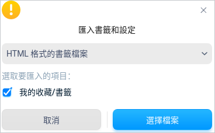

### 下載管理

將瀏覽器中的網頁、圖片等檔案下載儲存到電腦或儲存裝置上。

#### 下載檔案

1. 在瀏覽器中，開啟下載檔案所在的網頁。
2. 儲存相應檔案：

   - 大多數檔案：單擊下載連結。或者，右鍵單擊相應檔案並選擇 **另存為**。
   - 圖片：右鍵單擊相應圖片並選擇 **另存圖片**。
3. 根據頁面提示，選擇下載檔案的存放路徑，然後單擊 **儲存**。

4. 下載完畢後，該檔案會顯示在瀏覽器底部，單擊檔案名即可開啟這個檔案。
   如果想查看該檔案所在的路徑，請單擊檔案名旁邊的向上箭頭，並選擇 **在資料夾中顯示**。也可以在「下載」頁面中查看下載檔案。

您還可以設定自動下載：

1. 在瀏覽器中，選擇   > **設定**，進入設定頁面。
2. 在左側導航欄單擊  **隱私權和安全性**，單擊網站設定旁邊的更多圖示 >，進入網站設定頁面。
3. 在「權限」區域，單擊自動下載旁邊的更多圖示 >，可以開啟自動下載詢問功能。

#### 暫停或取消下載

   - 在瀏覽器底部，找到要暫停或取消下載的檔案，單擊檔案名旁單擊向上箭頭，選擇 **暫停**/**繼續** 或 **取消**按鈕。

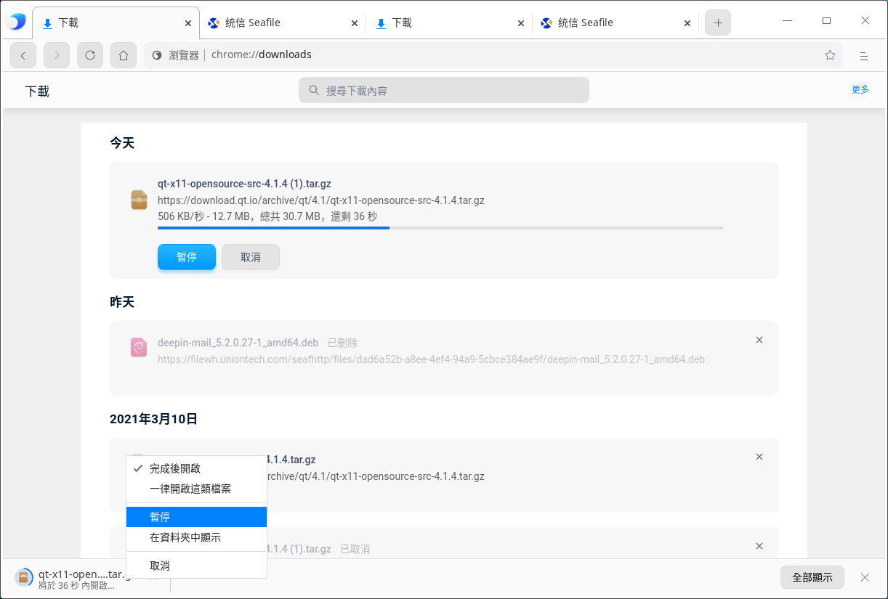

   - 在瀏覽器中選擇    > **下載**，選擇 **暫停**/**繼續** 或 **取消**按鈕。

#### 查看下載記錄

在瀏覽器中選擇    > **下載**，可以查看過往的下載記錄、查詢下載檔案。

- 要開啟檔案，請單擊相應的檔案名。系統會根據檔案類型使用預設的應用開啟該檔案。
- 要從記錄中移除某項下載內容，請單擊檔案右側的移除圖示 。系統會將該下載記錄從下載頁面中移除，但不會刪除下載的檔案。

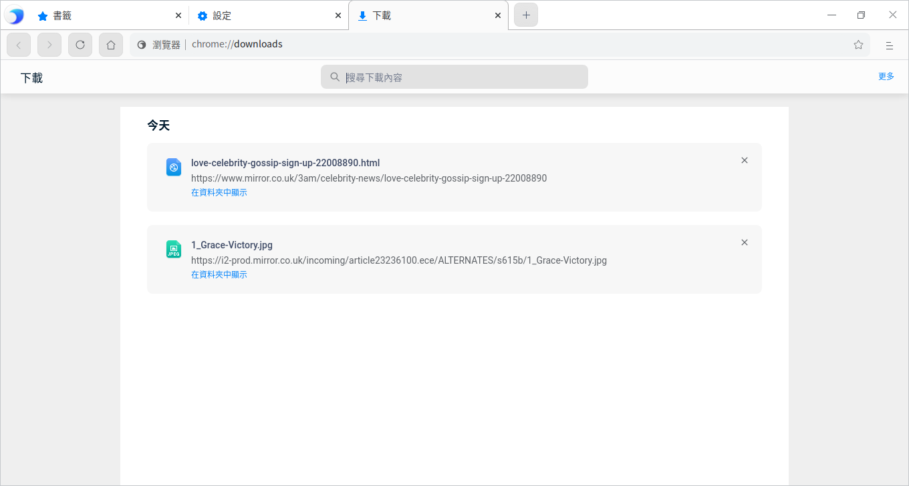

#### 設定預設存放路徑

您可以指定下載內容的預設儲存位置，也可以在每次下載時選擇特定的目標位置。

1. 在瀏覽器中，選擇    > **設定**，進入設定頁面。
2. 單擊進階下拉框，繼續單擊 **下載**，設定下載檔案的預設存放路徑。

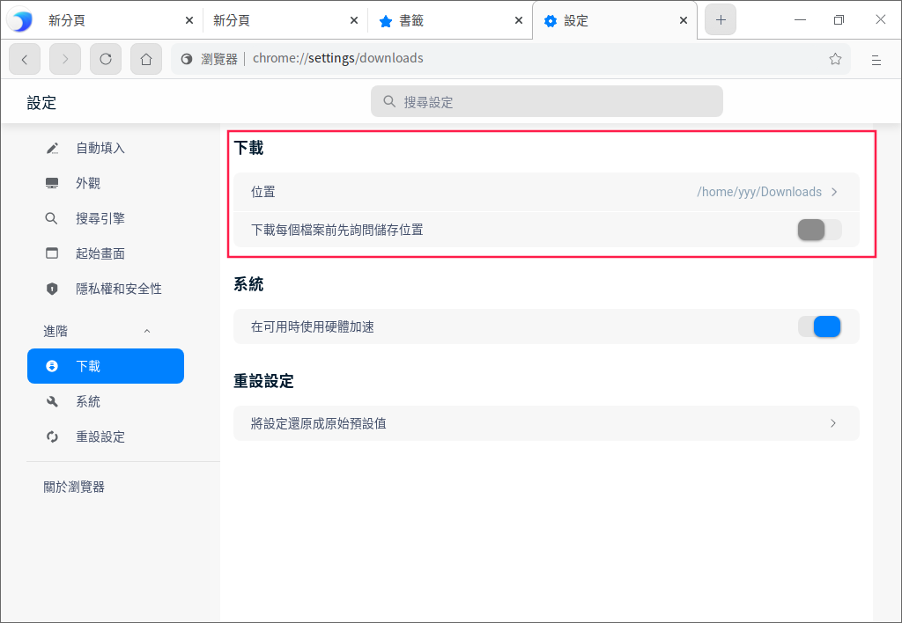

> 竅門：如果您要在每次下載時選擇具體的位置，請開啟詢問儲存位置功能。

### 記錄管理

#### 查看記錄

記錄包含了瀏覽器使用期間內所瀏覽的網站地址與具體時間。

在瀏覽器中選擇    > **記錄**，進入記錄頁面。

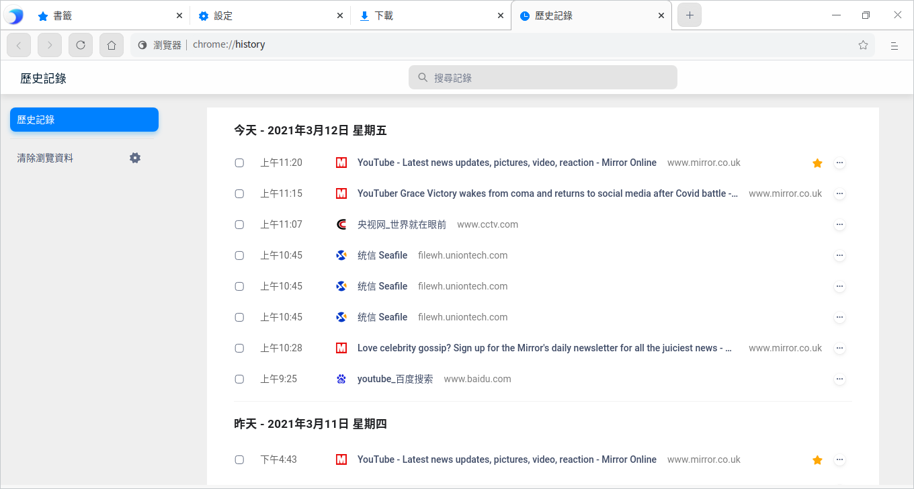

#### 刪除記錄

在記錄頁面，透過下列方法之一刪除記錄。

- 勾選需要刪除的記錄，單擊頁面右上角的 **刪除** 按鈕。
- 單擊某條記錄旁邊的操作按鈕，並選擇 **從記錄中移除**。

還可以清除瀏覽資料，詳細操作請參考設定頁面的 [清除瀏覽資料](#清除瀏覽資料)。

### 搜尋網路訊息

使用瀏覽器在網際網路上、書籤列表和瀏覽記錄中快速找到所需訊息。

1. 在瀏覽器頂部地址欄中，輸入需要搜尋的訊息，並在鍵盤上按下 **Enter** 鍵。
2. 您可以選擇 **網頁**、**圖片**、**新聞内容**、**影片** 或 **地圖** 進行尋找。

#### 尋找內容

在網頁中尋找特定字詞或短語。

1. 在瀏覽器中開啟一個網頁，在鍵盤上按下 **Ctrl** +**F**，或單擊    > **尋找**。
2. 在視窗的右上角出現的搜尋框中輸入關鍵字，按 **Enter** 鍵進行搜尋。
3. 系統會以藍色突出顯示匹配內容，可以根據滾動條上的藍色標記查看所有匹配內容在網頁中的位置。

#### 搜尋內容

1. 在瀏覽器中開啟一個網頁，滑鼠左鍵選中某個字詞、短語。
3. 單擊右鍵並選擇搜尋選項，即可使用您的預設搜尋引擎開始搜尋相關網頁。

### 列印

1. 在瀏覽器中，選擇需要列印的內容（網頁、圖片等檔案）。
2. 單擊右鍵選擇 **列印**，或選擇    > **列印**。
3. 彈出列印預覽頁面，選擇目標印表機、設定列印參數等。
4. 準備就緒後，單擊 **列印**。

### 查看原始碼

在頁面空白處，單擊滑鼠右鍵並選擇 **檢視網頁原始碼**。

### 開發者工具

當需要設計UI或除錯網站時，可以開啟開發者工具。

- 單擊    > **更多工具** > **開發人員工具**。
- 在頁面空白處，單擊滑鼠右鍵並選擇 **檢查**。
- 按下鍵盤上的F12。

> 注意：請勿用於非法途徑。

## 設定

### 設定預設瀏覽器

當開啟瀏覽器時，如果出現「這不是您的預設瀏覽器」提示，單擊 **設定為預設瀏覽器**。

> 竅門：在控制中心中將瀏覽器設定為預設的網頁程式，具體操作請參閱 [預設程式](dman:///dde#預設程式)。

### 設定首頁和啟動頁

對瀏覽器進行自訂，使其在開啟首頁或啟動頁時顯示任意網頁。這兩個網頁並不相同，除非您將二者設定為相同的網頁。 

- 啟動頁是啟動瀏覽器後看到的第一個網頁。
- 首頁是單擊首頁圖示  後進入的網頁。

#### 設定首頁

1. 在瀏覽器中，選擇    > **設定** ，進入設定頁面。
2. 在左側導航欄單擊  **外觀**，開啟顯示首頁按鈕，首頁按鈕 便會顯示在地址欄的左側。還可以設定開啟首頁時顯示的網頁：
   - **新分頁**：每次單擊首頁按鈕，會跳轉的新的分頁。
   - **輸入自訂網址**：每次單擊首頁按鈕，會跳轉到指定的網頁。

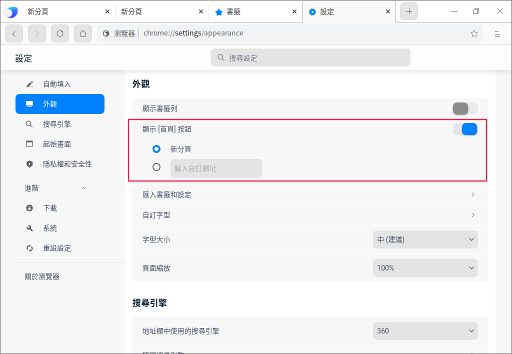

#### 設定啟動頁

1. 在瀏覽器中，選擇    > **設定** ，進入設定頁面。 
2. 在左側導航欄單擊 **起始畫面**，可以設定啟動瀏覽器時顯示的網頁。
   - **開啟新分頁**：啟動瀏覽器後，會開啟一個新的分頁。
   - **繼續瀏覽上次開啟的網頁**：啟動瀏覽器後，重新開啟退出瀏覽器時正在瀏覽的網頁。
     系統會儲存Cookie 和網站資料，因此您當時登入的任何網站（例如 Google）都會再次開啟。如果不想自動登入到這些網頁，請執行以下操作：
       1. 開啟瀏覽器，選擇    > **設定** ，進入設定頁面。
       2. 在左側導航欄單擊 **隱私權和安全性**，繼續單擊網站設定旁邊的更多圖示 >，進入內容網站設定頁面。
       3. 單擊「Cookie 和網站資料」旁邊的更多圖示 >，開啟「退出瀏覽器時清除Cookie 和網站資料」功能。

   - **開啟某個特定網頁或一組網頁**：啟動瀏覽器後，開啟任意指定的網頁。您可以在下方文字框中添加新網頁，後續也可以進行修改或刪除。

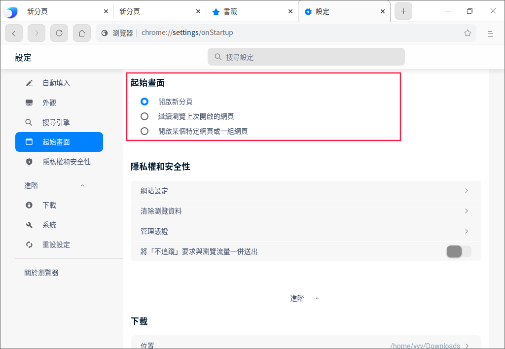

>  說明：

   - 如果您發現首頁或啟動頁並不是您自己設置的網頁，則表明您的系統上可能存在惡意軟體。

   - 如果您使用的是單位或學校的瀏覽器，網路管理員可能會為您選擇啟動頁，那麼您無法進行更改。如需獲取更多幫助，請諮詢您的管理員。

### 搜尋引擎管理

1. 在瀏覽器中，透過下列方法之一進入管理搜尋引擎頁面。

   - 將游標放在地址欄，單擊右鍵，選擇 **編輯搜尋引擎**。

   - 選擇    > **設定**，在左側導航欄單擊 **搜尋引擎**。
2. 進入搜尋引擎管理頁面後，可以添加新的搜尋引擎，或修改目前的搜尋引擎。

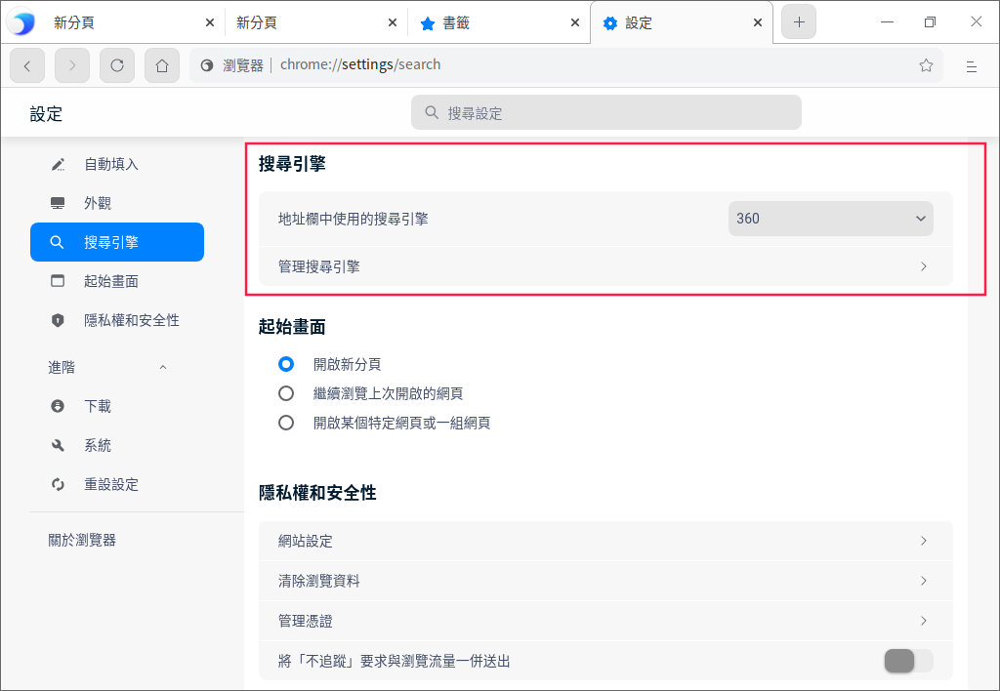

> 說明：如果您的預設搜尋引擎突然發生變化，則表明您的系統可能已遭到惡意軟體的攻擊。

### 密碼管理

如果您在某個網站上輸入新密碼，瀏覽器會詢問您是否要儲存此密碼。如需儲存，請單擊 **儲存**。

####  使用已儲存的密碼登入

如果您在之前瀏覽某個網站時儲存了該網站的密碼，再次登入時就不需要輸入使用者名稱和密碼。

- 如果您為該網站儲存了一組使用者名稱和密碼：瀏覽器會自動填寫登入表單。
- 如果您儲存了多組使用者名稱和密碼：請選擇使用者名稱欄位，然後選擇您要使用的登入訊息。

#### 刪除已儲存的密碼

1. 在瀏覽器中，選擇    > **設定**，進入設定頁面。
2. 在左側導航欄單擊 **自動填入**，繼續單擊密碼旁邊的更多圖示 >，進入密碼詳情頁面。

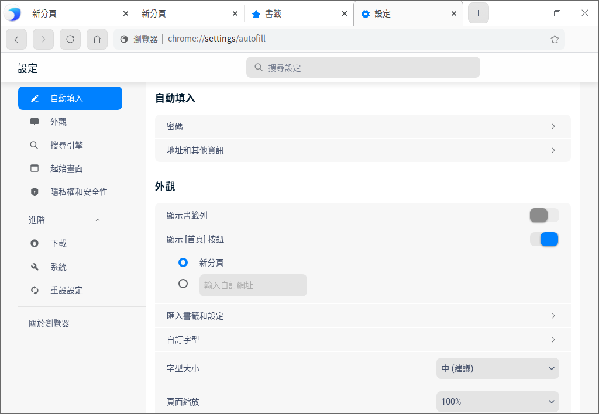

3. 可查看已儲存密碼的網站或刪除密碼。

要清除所有已儲存的密碼，請參閱 [清除瀏覽資料](#清除瀏覽資料)，然後勾選「密碼和其他登入資料」。

#### 啟用或停用儲存密碼的功能

預設情況下，瀏覽器會詢問您是否要儲存密碼。您可以隨時啟用或停用此功能。

1. 在瀏覽器中，選擇    > **設定**，進入設定頁面。
2. 在左側導航欄單擊 **自動填入**，繼續單擊密碼旁邊的更多圖示 >，進入密碼詳情頁面。
3. 開啟或關閉提示儲存密碼功能。

### 隱私權和安全性

#### 網站設定

在網站設定頁面，可以查看各網站的權限及儲存的資料。

1. 在瀏覽器中，選擇    > **設定**，進入設定頁面。
2. 在左側導航欄單擊 **隱私權和安全性**，繼續單擊「網站設定」旁邊的更多圖示  >，進入網站設定頁面。
3. 可以查看各網站的權限及儲存的資料，在「權限」區域，您還可以設定以下內容。

**Cookie和網站資料**

Cookie 透過儲存瀏覽訊息來讓您獲得更輕鬆的線上體驗，您可以進行以下設定：

- **允許網站儲存及讀取 Cookie 資料（建議）**：預設設定。
- **退出瀏覽器時，清除 Cookie 和網站資料**：在退出瀏覽器後自動刪除相應 Cookie。
- **封鎖第三方 Cookie**：網站無法使用Cookie來跟蹤您在網路上的活動，某些網站上的功能可能無法正常運作。
- 單擊 **顯示所有 Cookie 和網站資料**。
  - 刪除特定Cookie和網站資料：搜尋Cookie和網站資料的名稱，在該網站的網址右側單擊刪除按鈕。
  - 刪除所有的Cookie和網站資料·：單擊 **全部刪除**。

還可以在 **封鎖**、**退出時清除**、**允許** 選項下輸入對應網站地址。

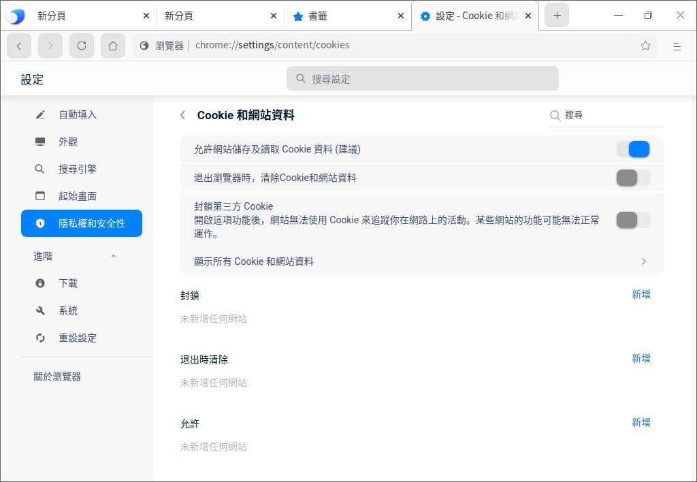

**位置**

預設情況下，瀏覽器會詢問您是否允許某個網站查看您的確切位置訊息。

- **允許**：允許網站訪問位置訊息。如果您允許瀏覽器將您的位置訊息分享給某個網站，瀏覽器會向搜尋引擎的位置訊息服務發送訊息，以便了解您的大致位置。隨後，瀏覽器會將您的位置訊息分享給該網站。
- **封鎖**：禁止網站訪問位置訊息。

**攝影機和麥克風**

某些網站可能會請求使用您的攝影機和麥克風，預設情況下，瀏覽器會詢問您是否允許某個網站開啟攝影機和麥克風。

- **允許**：允許網站開啟攝影機和麥克風。
- **封鎖**：禁止網站開啟攝影機和麥克風。

**JavaScript**

JavaScript 有助於提高網站的互動性，您可以添加允許和封鎖的網站。

**自動下載**

如果要從某個網站下載多個檔案，請選擇是否要自動下載這些檔案，您可以添加允許和禁止的網站。

以上簡單的介紹幾種網站權限，還有圖片、Flash、聲音、USB裝置、檔案修改等網站權限可以設定。

#### 清除瀏覽資料

1. 透過下列方法之一進入清除瀏覽資料頁面。

   - 選擇    > **設定** > **隱私權和安全性** > **清除瀏覽資料**
   - 選擇    > **記錄** > **清除瀏覽資料**

   - 選擇    > **更多工具** > **清除瀏覽資料**

2. 在基本和進階操作頁面勾選需要清除的資料：

     - 某段時間的資料，如：
       - 過去1小時
       - 過去24小時
       - 過去7天
       - 近4週
       - 不限時間
     - 瀏覽記錄
     - Cookie 和其他網站資料
     - 快取圖片和檔案
     - 下載記錄
     - 密碼和其他登入資料
     - 自動填入表單資料
     - 網站設定

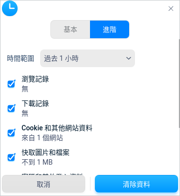

3. 勾選需要刪除的資料後，單擊 **清除資料**。

#### 憑證管理

在瀏覽器中可以匯入憑證，並管理憑證。

1. 在瀏覽器視窗，單擊    > **設定**，進入設定頁面。
2. 在左側導航欄單擊 **隱私權和安全性**，繼續單擊「管理憑證」旁邊的更多圖示 >，進入管理憑證頁面。
3. 單擊 **匯入**，跳轉到檔案管理器，選擇憑證檔案進行匯入。

#### 將「不追蹤」要求與瀏覽流量一併送出

此功能預設關閉，開啟後代表您不想被第三方網站追蹤。

### 系統

在可用時使用硬體加速：把計算量非常大的工作分配給專門的硬體來處理以減輕CPU的工作量，此功能預設開啟。比如播放影片，就可以利用顯示卡來解碼，這樣CPU就可以處理其他的任務，不會造成作業系統卡頓。

### 重設設定

單擊該按鈕後 ，可以重設部分設定項，例如重設搜尋引擎；但是系統不會清除您的書籤、記錄和已儲存的密碼。

### 主題

視窗主題包含亮色主題、暗色主題和系統主題。

1. 在瀏覽器介面，點擊 。
2. 點擊 **主題**，選擇一個主題顏色。

### 說明

查看說明手冊，進一步了解和使用瀏覽器。

1. 在瀏覽器介面，點擊 。
2. 點擊 **說明**。
3. 查看瀏覽器的說明手冊。

### 關於瀏覽器

1. 在瀏覽器介面，點擊 。
2. 點擊 **關於瀏覽器**。
3. 查看瀏覽器的版本和介紹。

### 結束

1. 在瀏覽器介面，點擊 。
2. 點擊 **結束**。